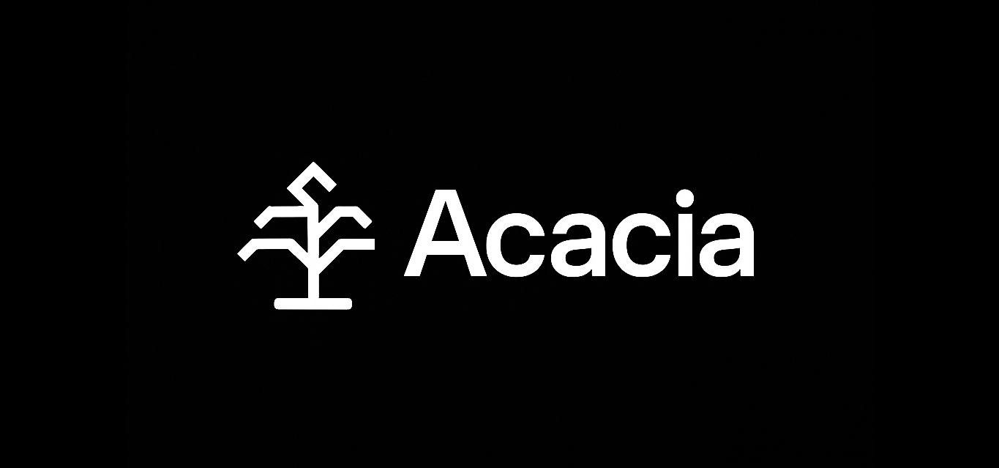

# Acacia

<p align="center">
  
</p>

Acacia is an Electron desktop browser that organizes tabs as a collapsible tree. The renderer is built with React, TypeScript, Vite, Tailwind CSS, and Zustand. The main process launches a single window, injects a hardened preload bridge, and manages webviews so every link you click can branch into its own nested context.

> [!CAUTION]
> This code is fully written by AI. Expect bugs and AI slop.

## Feature Highlights
- Nested tab tree in a resizable sidebar with expand/collapse, close tab, and close subtree actions.
- Modern browser toolbar with back/forward/home/reload controls and URL entry that normalizes host names to HTTPS.
- Link interception inside each webview so in-page navigation spawns child tabs while preserving the original context.
- Shared Electron preload that exposes a minimal `window.electronAPI` surface for IPC and dynamic preload resolution.
- Zustand-driven tab graph that keeps active state in sync across the tree and rehomes children when parents close.

## Tech Stack
- Electron 38 (main process, BrowserWindow, IPC handlers)
- React 18 with TypeScript and Vite for the renderer bundle
- Tailwind CSS, Radix Scroll Area, Lucide icons, class-variance-authority, tailwind-merge for UI
- Zustand for client-side tab state

## Getting Started
### Prerequisites
- Node.js 20.x or later (Electron 38 bundles Node 20; aligning locally avoids native mismatches)
- npm (comes with Node)

### Install dependencies
```bash
npm install
```

### Run the app in development
```bash
npm run dev
```
This script performs an initial TypeScript build of the main/preload code, then runs all of the following in parallel:
- `npm:watch:main` — incremental `tsc --watch` outputting to `dist/main` and `dist/preload`
- `vite` — serves the renderer on <http://localhost:5173>
- `wait-on` + `electron .` — waits for the Vite dev server before booting the Electron shell

### Production build
```bash
npm run build
```
Outputs `dist/main/index.js` from the TypeScript compiler and `dist/renderer` from Vite. The build keeps existing assets in `dist/` so you can ship both main and renderer bundles together.

### Launch a packaged-style build locally
After `npm run build`, run:
```bash
npm start
```
`main.js` verifies `dist/main/index.js` is present and then `require`s it to spin up the window. You can also run `npx electron .` as long as both the main and renderer bundles exist under `dist/`.

### Useful auxiliary scripts
- `npm run build:main` — one-off TypeScript compilation for `src/main` and `src/preload`.
- `npm run watch:main` — watch mode for main/preload code while you run Vite separately.

## Project Structure
```
.
├── main.js                  # Runtime shim that loads the compiled main process bundle
├── src/
│   ├── main/                # Electron main process (window creation, IPC handlers)
│   ├── preload/             # Preload scripts exposed via contextBridge, plus webview helpers
│   ├── renderer/            # React application (App shell, components, stores, styles)
│   └── common/              # Shared types/constants (e.g., tab model, HOME_URL)
├── dist/                    # Build artifacts (`dist/main`, `dist/preload`, `dist/renderer`)
├── docs/                    # PRD, TRD, UIDD functional and design references
├── vite.config.ts           # Vite config with path aliases `@renderer` and `@common`
├── tailwind.config.ts       # Tailwind design tokens mapped to CSS variables
└── tsconfig*.json           # TypeScript configs for renderer and main targets
```

## Runtime Architecture
- **Main process (`src/main/index.ts`)** creates the BrowserWindow, toggles between Vite dev server and bundled HTML, exposes preload paths via `ipcMain`, and funnels external links to the OS browser.
- **Preload (`src/preload/index.ts`)** exposes a constrained `electronAPI` with `invoke`, `send`, `on`, and `getPreloadPath` helpers. The separate `webview` preload wires click interception, metadata, and navigation events sent back to the host.
- **Renderer (`src/renderer/App.tsx`)** composes the layout: a tab tree sidebar, a draggable divider, a toolbar, and a `WebviewManager`. The manager owns a pool of `<webview>` tags and coordinates navigation state per tab.
- **State management (`src/renderer/stores/tabStore.ts`)** keeps a normalized tree of tabs, ensures a root tab always exists, and gracefully reassigns focus/parentage when nodes close.
- **Styling** uses Tailwind CSS tokens defined in `src/renderer/index.css`, paired with lightweight UI primitives in `src/renderer/components/ui`.

## Configuration Notes
- Default home page is defined in `src/common/tabs.ts` (`HOME_URL`). Update this constant to change the first tab’s URL and the toolbar’s home action.
- Path aliases `@renderer` and `@common` are configured in both `vite.config.ts` and `tsconfig` files; ensure your editor respects them for linting and IntelliSense.
- The renderer expects the preload bundle at runtime. When adding new preload scripts, export them from `src/preload/` and update `getPreloadPath` if you introduce new keys.

## Testing Status
`npm test` is currently a placeholder that exits with an error. The repository standards call for Jest/Vitest under `tests/unit/` and Electron E2E under `tests/e2e/`; add those suites before enabling CI.

## Documentation
- `docs/PRD.md` — product requirements and scoped MVP features
- `docs/TRD.md` — architectural guidance and planned module responsibilities
- `docs/UIDD.md` — UI layout and interaction references

## Roadmap & Known Gaps
- Session persistence, drag-and-drop reordering, and context menus are outlined in the TRD/UI docs but not yet implemented.
- Import/export flows, settings surface, and automated testing are still TODOs.
- Packaging/distribution scripts (e.g., `electron-builder`) are not configured; use `electron-packager` or similar tooling when you are ready to ship builds.

## Contributing
Follow the repository guidelines in `AGENTS.md`: use two-space indentation, single quotes in TypeScript, keep commits scoped with Conventional Commit prefixes, and document any manual validation steps in PRs.
